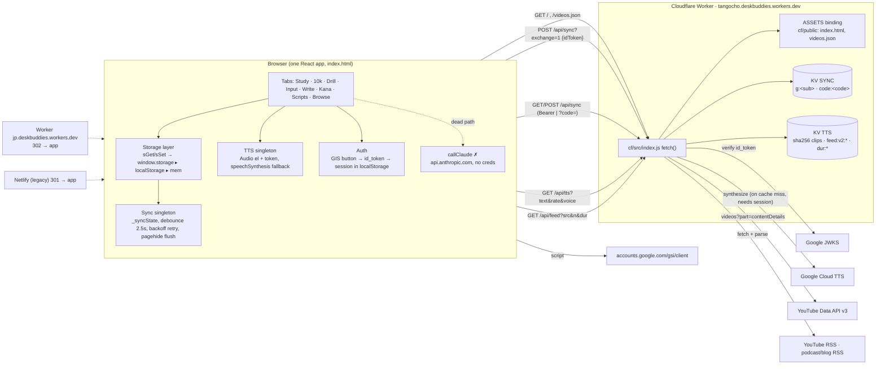
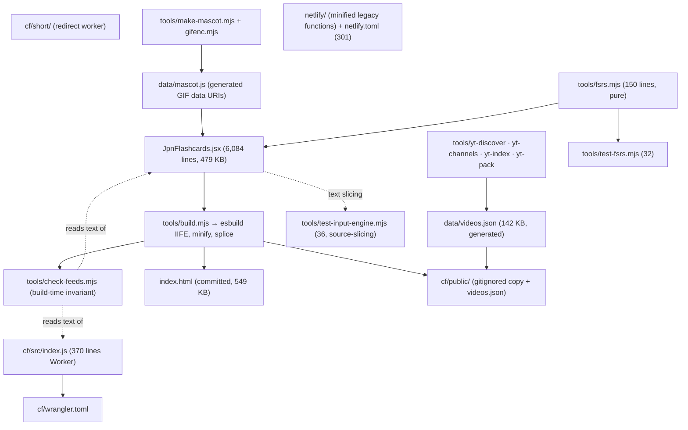
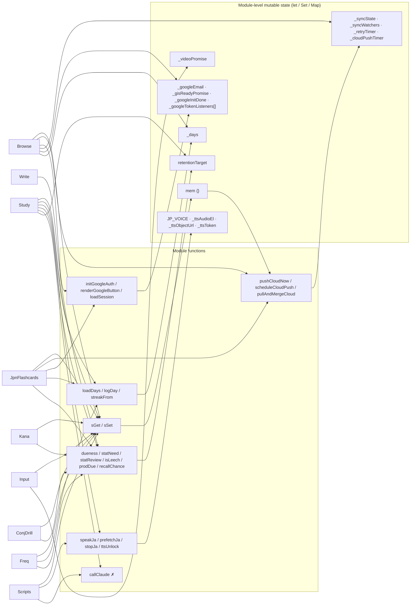
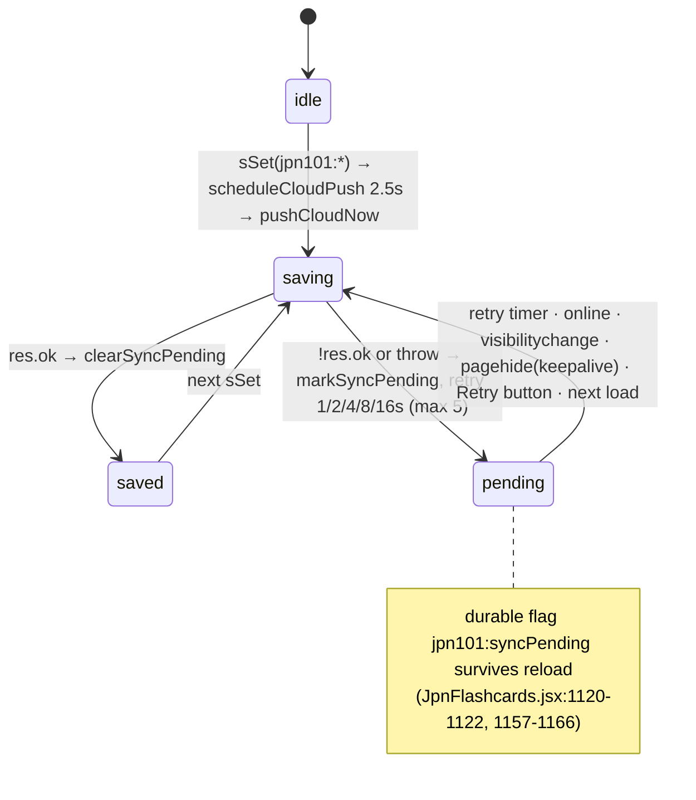

# tangocho — Architecture, Code Quality, Maintainability, Testing & DevOps Review

**Repo:** `/Users/dan/Code/matthew-japanese/tangocho` (clone of github.com/matthewames/tangocho, `main` @ `7b9e110`, 45 commits, 26 tracked files)
**Review date:** 2026-08-22
**Reviewer scope:** architecture, code quality, maintainability, React patterns, data model, testing, build/deploy, docs, ops. Security and UX are covered by sibling reports; they are mentioned here only where they intersect with maintainability.

Every claim below cites `file:line` against the commit above. Numbers were measured (wc/grep/awk/node), not estimated, unless labelled "by inspection". Nothing in the tracked tree was modified; the build was run on a copy in the scratchpad.

---

## 1. Executive summary

- **The committed build artifact is in sync with source.** A fresh `npm install` + `node tools/build.mjs` on a copy of the repo (Node v24.7.0, esbuild ^0.25, React 18.3) produced an `index.html` that is **byte-identical** to the committed one (`cmp` → identical; 549,163 bytes). Build output: `feeds 17 sources, app and Worker agree` / `ok bundle 535.7kb -> index.html 536.2kb (+ cf/public, 955 videos)`. Nothing enforces this today — it is true because the last committer was careful, not because a check exists.
- **Both test suites pass:** `test-fsrs.mjs` 32/32, `test-input-engine.mjs` 36/36. Coverage is narrow: the FSRS math and the Input level engine. The sync merge, seed migration, session scheduling, `conjugate()`, and the entire Cloudflare Worker have **zero** automated tests — and a real bug in the Worker confirms it (see next bullet).
- **Verified Worker bug:** `iso8601ToSeconds` in `cf/src/index.js:285` uses `(d+)` instead of `(\d+)`, so it matches literal "d" characters; `PT5M30S → 0` (checked with node). Every YouTube duration resolved through `/api/feed?dur=1` silently comes back as "unknown", and the Data API call is repeated on every request instead of being cached.
- **The single 6,084-line / 479 KB `JpnFlashcards.jsx` is 57% data and CSS by bytes** (SEED 131.6 KB, SCRIPT_SEED 60.2 KB, CSS 39.9 KB, FREQ_SEED 17.2 KB, INPUT_CATALOG 8.2 KB, CONJ_BANK 7.3 KB, kana tables 5.4 KB, SECTION_MAP 2.6 KB). The remaining ~207 KB of logic+JSX is ~4,000 lines across 11 components and ~110 module-level functions sharing ~20 mutable module-level variables. Splitting the data out alone would cut the file in half with essentially no risk.
- **Module-level side effects block testability.** `window.addEventListener` at `JpnFlashcards.jsx:1157-1166`, `localStorage` read at `:1195`, `speechSynthesis` at `:3361`, and a `ReactDOM.createRoot(...).render` at `:6084` all run on import. Consequence: `tools/test-input-engine.mjs:13-46` has to **regex/brace-slice functions out of the source text and `eval` them** to test anything. This is the single biggest maintainability cost and the first thing the modularization plan fixes.
- **An artifact-era AI path is still wired in and can never succeed in production.** `callClaude()` (`JpnFlashcards.jsx:2180-2202`) POSTs to `https://api.anthropic.com/v1/messages` from the browser with no credentials (this only worked inside the Claude.ai artifact sandbox). It is invoked by the Study "✨ hook" button (`:1519`), an **automatic** end-of-session debrief (`:1730`), and Scripts annotation (`:3540`). The `Sentences` tab that also uses it is not rendered at all (`:2354-2497`, 0 references). Given this repo already had one exposed-API-key incident (`75c7254`), leaving a client-side Anthropic call in place is an invitation to "fix" it by pasting a key.
- **Dead code is modest but real:** `Add` (50 lines, never rendered), `Sentences` (144 lines) plus its helper chain (`fillPrompt/transPrompt/gradePrompt/localFill/localTrans/pickTarget/NOUN_SET/fillMatch/canonR/kanaToRomaji/kataToHira`, ~120 lines), the sync-code trio (`genSyncCode/getSyncCode/setSyncCode`) — **but note** `getSyncCode()` is still *live* as the unauthenticated fallback in `syncRequestOptions` (`:1093-1102`) and the Worker still accepts `?code=` (`cf/src/index.js:128-131`), so anonymous visitors write KV entries nobody can ever read back. `oralAttempts`, `weakness()`, `focusPool`, `signOutGoogle()`, `norm()`, `liveRef` are also unreferenced.
- **Duplication hot spots:** the canvas writing pad (~35 lines ×2 in Kana `:2673-2710` and Write `:3724-3760`), the backup collector (~20 lines ×2, `:1275-1296` vs `:3834-3854`), the session bookkeeping block (passed/firstTry/struggled/requeue) ×3 (Study `:1734-1760`, Kana `:2713-2740`, ConjDrill `:5060-5085`), the think-timer effect ×5, and `try { const r = await sGet(k); if (r) x = JSON.parse(r); } catch (e) {}` ×~25.
- **DevOps is manual and undocumented:** deploy is `node tools/build.mjs && cd cf && npx wrangler deploy` (only written down in `tools/REFRESH-VIDEO-INDEX.md:13-15`); wrangler is unpinned; no CI, no tags, no README/LICENSE/CONTRIBUTING/CLAUDE.md; the build number `b59` is a hand-edited string (`:1459`); secrets process lives in a `wrangler.toml` comment (`cf/wrangler.toml:26-28`); no KV backup, no observability, no quota alerts.
- **What is genuinely good** (see §2): build sanity checks that hard-abort, `check-feeds.mjs` as a build-time cross-file invariant, a schema-versioned feed cache key, per-key merge rules with documented rationale, an unusually high density of *why*-comments, and 29 Claude-co-authored commit messages that read like design notes — a large share of the project's real documentation lives in `git log`.

---

## 2. What's done well

Credit where it is due — several decisions here are better than what most small projects ship with:

| Decision | Where | Why it matters |
|---|---|---|
| Build hard-aborts if the bundle lacks the mount call or `#root` | `tools/build.mjs:46-57` | Directly prevents a recurrence of the blank-page incident (`90cf825`). |
| Build refuses to splice if the `<script>` boundary isn't the one after `<div id="root">` | `tools/build.mjs:66-79` | Guards the fragile "splice minified JS into HTML" step. |
| Cross-file invariant checked at build time (`FEED_SOURCES` ⟷ Worker `FEEDS` ⟷ catalog ids) | `tools/check-feeds.mjs`, imported at `build.mjs:61` | Catches a silent runtime degradation at build. Model for the other invariants listed in §7. |
| Feed cache key carries a schema version (`FEED_SCHEMA`) | `cf/src/index.js:224-227` | Prevents stale-shape cached JSON after a deploy. |
| Sync merge is per-key with explicit rules (deck per-card, days per-day, scripts union, input append-only log) | `JpnFlashcards.jsx:936-1020` | Offline-on-two-devices doesn't lose progress; each rule has a comment explaining the failure it prevents. |
| Save path checks `res.ok`, keeps a durable pending flag, retries with backoff, flushes on `pagehide` with `keepalive` | `:1111-1166` | The "progress is the one thing that can't be regenerated" principle is enforced in code, and the UI reflects the real state (`SYNC_UI` `:3815-3820`). |
| Pre-migration snapshots before seed merges | `:1330`, `:5419` | Cheap insurance before a destructive step. |
| Write-through ref for multi-tap state (`stRef` in Input) | `:4570-4580` | Correct fix for the lost-write race, explained in place. |
| FSRS extracted to a real module with a real test file | `tools/fsrs.mjs`, `tools/test-fsrs.mjs` (32 tests) | The one piece of logic that was extracted is the one that is well tested — proof the approach works here. |
| Why-comments everywhere | 402 of 6,084 lines carry a comment; many are 5-15 line rationale blocks (e.g. `:1563-1572`, `:2118-2125`, `:4444-4450`) | Future maintainers (and future Claude sessions) get the *reason*, not just the *what*. |
| Commit messages as design records | 29/45 commits carry multi-paragraph bodies with data, verification steps, and rejected alternatives (e.g. `2acc723`, `22cf183`, `110a16f`, `5cc3ede`) | This is the project's de-facto ARCHITECTURE.md. §10 proposes promoting it into files. |
| `data/videos.json` kept outside the bundle | `build.mjs:90-102` | Data on a different cadence from code; app still starts if it fails. |
| Netlify kept only as a forced 301 with a comment explaining the orphaned-blob-store risk | `netlify.toml` | Prevents silent writes into dead storage. |
| Secrets never in config; `wrangler.toml` lists which are required | `cf/wrangler.toml:26-28` | Minimal but correct. |
| Worker owns feed URLs (no open proxy) | `cf/src/index.js:199-201` | Good security reflex, documented. |

---

## 3. Architecture map

### 3.1 Runtime architecture



Notes:
- The client still calls the **legacy paths** `/.netlify/functions/{sync,tts,feed}` (`JpnFlashcards.jsx:906`, `:3352`, `:4181`); the Worker answers both shapes (`cf/src/index.js:365-367`). This was a deliberate, reversible-cutover choice (`11dee08`); the cutover is done and Netlify now 301s everything (`1bb98c1`), so the legacy shape can be retired.
- The two KV namespaces are used for **five** concerns: SYNC holds Google-keyed and code-keyed snapshots; TTS holds audio clips, feed caches and duration caches by prefix.

### 3.2 Source layout



### 3.3 Inside `JpnFlashcards.jsx` — sections and module-level state

Line map (top-level declarations, measured with `grep -nE '^(const|let|function|export)'`):

| Lines | Section | Kind | Size |
|---|---|---|---|
| 1-16 | imports, STORE/SEED keys, `SEED_VERSION = 30` | config | |
| 17-862 | `SEED` (821 vocabulary entries; **17 duplicate terms**) | data | 845 lines / 131.6 KB |
| 863-899 | `uid`, storage layer `mem/sGet/sSet` | infra | |
| 900-1020 | sync code, `collectLocalSnapshot`, `mergeDeck/Days/Scripts/Input/Snapshots` | infra | |
| 1022-1102 | Google auth: `loadSession/saveSession/signOutGoogle/gisReady/exchangeForSession/initGoogleAuth/renderGoogleButton/syncRequestOptions` | infra | |
| 1103-1183 | cloud push/pull: `_syncState`, `pushCloudNow`, `scheduleCloudPush`, window listeners, `pullAndMergeCloud` | infra | |
| 1185-1267 | `KIND_LABEL`, retention target, days log, streak, mascot, `detectKind/isEmoji` | infra/UI | |
| 1269-1496 | `JpnFlashcards` root component (tabs, load→merge→push chain, `recordResult`) | component | 228 |
| 1497-2041 | `Study` | component | **545** |
| 2042-2150 | scheduling: `isWeak/masteryScore/REVIEW_INTERVALS/recallUnlocked/effLevel/isLeech/dueness/statReview/statNeed/prodDue/recallChance/needScore` | domain | |
| 2151-2178 | `SECTION_MAP` (one 2,554-char line), `sectionOf/hueFor/sectionArt/sectionRank` | data+UI | |
| 2180-2343 | `callClaude`, `parseJSON`, `norm`, kana→romaji maps, AI prompts, `localFill/localTrans` | dead-ish | |
| 2344-2497 | `Furigana`, `Sentences` (unrendered) | component | 144 |
| 2498-2577 | kana tables, `fmtSecs` | data | |
| 2578-2936 | `Kana` | component | 359 |
| 2937-3350 | `scriptPrompt`, `SCRIPT_SEED` (33 scripts) | data | 403 lines / 60.2 KB |
| 3352-3449 | TTS singleton | infra | |
| 3450-3460 | `lineText`, `hookPrompt`, `debriefPrompt` | helpers | |
| 3461-3707 | `Scripts` | component | 247 |
| 3708-3814 | `Write` | component | 107 |
| 3815-4066 | `SYNC_UI`, `Browse` | component | 245 |
| 4067-4116 | `Add` (unrendered) | component | 50 |
| 4117-4178 | `CONJ_TYPES`, `CONJ_BANK`, `CONJ_FILTERS` | data | |
| 4179-4332 | Input infra: video index loader, `FEED_SOURCES`, `INPUT_CATALOG` | infra/data | |
| 4333-4543 | Input engine: `applyRating/seedLevelsFromDeck/seededShuffle/recommend/coverageAgainstDeck`, UI helpers | domain | |
| 4544-4953 | `Input` | component | **410** |
| 4954-5001 | `GODAN_ROWS`, `conjugate`, `CONJ_FORMS` | domain | |
| 5002-5221 | `ConjDrill` | component | 220 |
| 5222-5378 | `FREQ_SEED` (148 entries) | data | 154 lines / 17.2 KB |
| 5379-5600 | `fmtIn`, `Freq` | component | 213 |
| 5601-6081 | `CSS` template string | style | 480 lines / 39.9 KB |
| 6083-6084 | `import ReactDOM`; `createRoot(...).render` | mount | |

### 3.4 Component ⟷ singleton dependency map



**Implicit global state and the risks it carries**

| Variable | Lines | Written by | Read by | Risk |
|---|---|---|---|---|
| `mem` | 870 | `sSet` | `sGet` | Memory fallback keeps stale values if a later `localStorage.setItem` outside `sSet` (e.g. `pullAndMergeCloud` `:1177`) writes the same key — `sGet` prefers localStorage so it's safe today, but only by ordering. |
| `_syncState`, `_syncWatchers` | 1112-1113 | `setSyncState` | Browse via `watchSyncState` | Mini-store without React; fine, but un-testable without a DOM and undocumented as the pattern. |
| `_retryTimer`, `_cloudPushTimer` | 1124, 1152 | push/schedule | — | `pushCloudNow` is recursive on failure; concurrent callers (online + visibilitychange + pagehide + effect) can run overlapping POSTs — last writer wins on a blind-overwrite server (`cf/src/index.js:141`). |
| `_googleTokenListeners` | 1070 | `initGoogleAuth` push | GIS callback | **Grows without bound**: Browse re-runs `initGoogleAuth(...)` every time `googleEmail` changes (`:3911-3914`) and every mount; there is no unsubscribe. Harmless today (tiny), but it's a leak pattern. |
| `_googleEmail` | 1045 | `exchangeForSession`, `signOutGoogle` | Browse initial state | Read at module load from localStorage; component state snapshot can drift from it. |
| `retentionTarget` | 1194 | module init, `setRetention` | FSRS calls | Read from localStorage at **import time** (`:1195-1198`) — importing the module in Node throws unless `window` is stubbed. |
| `_days` | 1205 | `loadDays`, `logDay`, Browse restore (`:3902` assigns directly) | Study/Freq | Two write paths (`logDay` and `_days = cur`), no invalidation when the cloud pull overwrites `jpn101:days` in localStorage (`:1177`) → in-memory `_days` can be stale until reload. |
| TTS vars | 3354, 3391-3393 | speak/stop | — | Correctly guarded by token; untestable without `Audio`. |
| `_videoPromise` | 4196 | `loadVideoIndex` | Input | Cached forever per page load; fine. |
| Module-load side effects | 1157-1166, 1195, 3361, 6084 | — | — | **Importing the file mutates the page** (adds listeners, reads storage, mounts React). This is why tests slice source text instead of importing. |

### 3.5 Sync state machine



Load sequence (`:1312-1346`): `pullAndMergeCloud()` → read deck → seed-merge (if `ver < SEED_VERSION`) → `setCards` → `pushCloudNow()`. Re-run once after sign-in (`:1351-1353`). This is the fix for the `69b7305` race and is correct *given* the server is blind-overwrite; it would still be worth sending `updatedAt` of the last pull and having the server reject stale overwrites (a compare-and-set), which KV can't do natively — document this as a known limitation.

---

## 4. Code quality metrics

### 4.1 Size and shape

| Metric | Value | Source |
|---|---|---|
| `JpnFlashcards.jsx` lines / bytes | 6,084 / 479,241 | `wc` |
| code / blank / comment-leading lines | 5,711 / 265 / 108 | awk |
| lines containing a comment | 402 (6.6%) | grep |
| average line length | 77.8 chars | awk |
| lines > 160 chars / > 200 chars | 618 / 240 | awk (mostly data rows; worst non-data: `SECTION_MAP` at 2,554 chars, `:2151`) |
| data + CSS bytes | ≈272 KB of 479 KB (57%) | per-range `wc -c` |
| top-level declarations | ~190 (`const`/`let`/`function`) | grep |
| `useState` / `useEffect` / `useMemo` / `useRef` / `useCallback` | 115 / 32 / 29 / 30 / 27 | grep |
| `sGet(` / `sSet(` / `JSON.parse(` / `JSON.stringify(` | 30 / 37 / 33 / 36 | grep |
| direct `localStorage` uses outside `sGet/sSet` | 31 | grep |
| `try {` / empty `catch (e) {}` | 96 / 59 | grep |
| `Date.now()` | 56 | grep |
| `fetch(` | 9 | grep |
| inline `style={{` | 22 | grep |
| `className="tc-` | 484 | grep |
| `console.*` | **0** | grep |
| `TODO/FIXME/HACK/XXX` | **0** | grep (also 0 in `cf/` and `tools/`) |
| `eslint-disable` | 2 (`:4568`, `:4629`) — evidence a linter was run at some point, but no config is committed | grep |
| `React.StrictMode` | not used | grep |
| Error boundary | none | by inspection |

### 4.2 Component / function length (lines, top-level)

| Function | Lines | Start | Note |
|---|---|---|---|
| `Study` | 545 | 1497 | 10 `useMemo`, 5 `useEffect`, 3 render branches; the session engine + setup screen + card + summary in one function |
| `Input` | 410 | 4544 | state machine for panels, engine calls, ~195 lines of JSX |
| `Kana` | 359 | 2578 | drill + canvas pad + chart + summary |
| `Scripts` | 247 | 3461 | 3 views |
| `Browse` | 245 | 3822 | backup/restore/pack-apply/auth/sync UI/list |
| `JpnFlashcards` | 228 | 1269 | root: load chain + `recordResult` (60 lines of FSRS/level logic inside a `setCards` updater, `:1404-1451`) |
| `ConjDrill` | 220 | 5002 | |
| `Freq` | 213 | 5388 | |
| `Sentences` | 144 | 2354 | **unrendered** |
| `Write` | 107 | 3708 | |
| `coverageAgainstDeck` | 66 | 4444 | densest algorithmic function; well commented; tested |
| `recommend` | 57 | 4387 | tested |
| `Add` | 50 | 4067 | **unrendered** |
| `conjugate` | 29 | 4961 | pure; **untested** |
| `pushCloudNow` | 27 | 1125 | |

Rule of thumb: anything over ~150 lines here is a component doing three jobs (setup / session / summary). The session engine (queue, pos, passed, firstTry, struggled, missRef, requeue) is the same in Study, Kana and ConjDrill and is the obvious extraction (§9 step 6).

### 4.3 Cyclomatic hot spots (by inspection)

- `recordResult` (`:1404-1451`): nested ternaries for `delta`, `fast/crawl`, direction branching, FSRS state swap, two return shapes — ~12 branches inside a state updater. Pure and extractable as `applyReview(card, {got, dir, ms, now, retention})`.
- `Study.smartPool` (`:1563-1605`): 4 filters, 3 sorts, slot arithmetic, splice interleave. Pure given `(cards, now)`; extractable and testable (the `2acc723` "36% day" bug lived exactly here).
- `Browse.doRestore` (`:3856-3904`): two formats (`tangocho` vs `tangocho-pack`), 8 optional keys, seed back-fill, day merge. Should be `restoreBackup(o, deps)` in a module with fixtures.
- `mergeSnapshots` (`:1008-1020`): key-switch with 6 special cases + 2 generic rules; correctness depends on a hard-coded key list.
- `coverageAgainstDeck` (`:4444-4508`): tokenizer with 3 token classes; tested, fine.
- Worker `handleFeed` (`:319-359`): parallel fetch, cache write, optional duration enrichment, rewrite cache — moderate.

### 4.4 Duplicated code (evidence)

| Pattern | Occurrences | Lines |
|---|---|---|
| Canvas writing pad (`setup` with DPR, `xy/down/move/up`, touch-block effect, resize effect) | 2 | Kana `:2673-2710`, Write `:3724-3760` — ~35 lines near-verbatim |
| Backup blob collector (7× `sGet`+`JSON.parse`, blob, `<a download>`, clipboard) | 2 | `bannerBackup` `:1275-1296`, `doBackup` `:3834-3854` |
| Session bookkeeping (`passed/firstTry/struggled` Sets, `missRef`, requeue splice, drop-later-duplicates) | 3 | Study `:1734-1760`, Kana `:2713-2740`, ConjDrill `:5060-5085` |
| Think-timer effect `shownRef/thinkRef` reset on `[pos, …]` | 5 | `:1535`, `:2639`, `:3763`, `:5052`, `:5401` |
| Per-deck stat write (`seen/correct/level/streak/last/fsrs/ms/msN`) | 3 (+ deck variant) | Kana `:2716-2722`, ConjDrill `:5062-5068`, Freq `:5484-5490`, deck `:1432-1450` |
| `try { const r = await sGet(K); if (r) X = JSON.parse(r); } catch (e) {}` | ~25 | `:1277-1283`, `:1513`, `:2601`, `:3835-3842`, `:3872`, `:3898`, `:4560`, `:5023`, `:5413-5426` … |
| "Go again / Review the N you missed / Done" summary block | 3 | Study `:1929-1938`, Kana `:2811-2818`, ConjDrill summary |
| Segmented chip bar (`tc-fchip is-on` map) | ~8 | Study, Kana, Input, Browse, ConjDrill |
| Sync/TTS/feed endpoint constants using legacy path | 3 | `:906`, `:3352`, `:4181` |

A `useSession()` hook + `loadJSON(key, fallback)` helper + `<WritingPad>` component + `collectBackup()` would remove ~250 lines.

### 4.5 Magic numbers

Most constants are named (`REQUEUE_GAP/CAP`, `KANA_REQUEUE_GAP/CAP`, `PROD_UNLOCK_STABILITY`, `FEED_TTL`, `SESSION_DAYS`, `SESSION = 16`). Unnamed ones worth lifting: `2500` debounce (`:1155`), `30000` retry cap and `5` attempts (`:1143-1144`), `3000/6000/10000` ms latency thresholds (`:1414-1415` — also duplicated in `tools/fsrs.mjs gradeFromLatency`), `0.08/0.05/-0.15` ease deltas (`:1416`), `0.55..1.8` ease clamp (`:1427`), `40/15 → 3/5/8` new-slot ladder (`:1581`), `4` prod slots, `6` prod cap (`:1705`), `400` history cap (`:992`, `:4694`), `6` pending cap, `14` days recent (`:4389`), `1.25` time budget slack (`:4433`, `:4617`), `250..180000` ms sanity bounds (`:1405`), `0.88/0.68/0.9` TTS rates (`:1540`, `:3447`, `:3479`), `7 * 86400000` backup nag (`:3980`), `730` days session (`cf:19`), `900000` feed byte cap (`cf:337`).

### 4.6 Naming consistency

- Storage keys: all `jpn101:*` (24 distinct, table in §6.2) — consistent, but the brand is `tangocho` and the app is past JPN 101; a rename is a migration, so just document it.
- Component-local stat records use `seen/correct/level/streak/last/ms/msN/fsrs` uniformly across deck, kana, conj, freq — good. Production direction uses `r`-prefix (`rseen/rcorrect/rlevel/rms/rmsN/rfsrs`) — consistent but cryptic; document.
- Private module vars use `_leading` — consistent.
- Mixed English/Japanese identifiers are fine; CSS uses a consistent `tc-` prefix (484 uses).
- A few misleading names: `coverage` in Study (`:1560`) is a boolean never used except as a `useCallback` dep (`:1719`); `weakness()` vs `isWeak()`; `TTS_OK` means "speechSynthesis available", not "TTS OK".

### 4.7 Comment quality

Excellent on *why*; light on *contracts*. Examples worth keeping as-is: storage fallback rationale `:865-869`, sync race `:1305-1311`, session-mix rationale `:1563-1572`, FSRS plumbing `:2098-2104`, production clock `:2120-2126`, Input catalog casualties `:4167-4176`, coverage tokenizer rules `:4462-4469`, Worker open-proxy note `cf:199-201`, duration dead-ends `cf:271-283`. What's missing: a header comment per section describing the **data shape** it owns (card, stat record, snapshot, backup, input state) and the **invariants** (e.g. "every key in `SYNC_SKIP_KEYS` must not be synced; every synced key needs a merge rule or accepts last-snapshot-wins").

Stale comments: `:4` "Cards are saved with window.storage" (artifact-era); `:900` "Netlify Blobs via /.netlify/functions/sync" (now KV via Worker); `:1028` "Falls back to the manual sync code only if the user has never signed in" (the UI for that was removed in `2afa8d5`); `:4117-4121` "Negative-form drill" header (the drill does all 8 forms since `1eaa12c`); `tools/package.json` description and `build.mjs:3-4, 22-25` still explain Netlify's no-build-step constraint (no longer binding).

### 4.8 Dead code (each with evidence)

| Symbol | Lines | Evidence | Verdict |
|---|---|---|---|
| `Add` component | 4067-4116 | `<Add` 0 matches; `goAdd` navigates to `browse` (`:1481`) | dead (50 lines) |
| `Sentences` component | 2354-2497 | `<Sentences` 0 matches; no `"sentences"` tab id | dead (144 lines) |
| `fillPrompt/transPrompt/gradePrompt/vocabList` | 2266-2299 | only referenced from `Sentences` (`:2370`, `:2403`) | dead chain |
| `localFill/localTrans/pickTarget/NOUN_SET/shortMeaning` | 2301-2343 | only from `Sentences` (`:2374`) | dead chain |
| `fillMatch/canonR/kanaToRomaji/kataToHira/KANA_MAP/YOON_MAP` | 2217-2264 | `fillMatch` only at `:2385` (Sentences) | dead chain (~50 lines) — note `kanaToRomaji` is a genuinely useful utility; keep it in `src/lib/kana.js` with tests if Sentences is ever revived |
| `norm` | 2210 | defined, never called | dead |
| `weakness` | 2042 | defined, never called | dead |
| `focusPool` | 1558 | computed in Study, never read | dead memo |
| `coverage` (Study) | 1560 | only appears in deps array `:1719` | dead |
| `liveRef` | 1528, 2037 | rendered `aria-live` region, never written to | dead (and an a11y intent never finished) |
| `signOutGoogle` | 1041 | never called — there is no sign-out UI | dead |
| `setSyncCode` | 923 | never called | dead |
| `genSyncCode/getSyncCode/SYNC_KEY` | 905-922 | **live** via `syncRequestOptions` fallback `:1101` | *not* dead — see Finding F-5 |
| `oralAttempts` key | 1283, 3842, 3886 | Oral tab removed in `07120db`; key still collected into backups and restored | legacy carry-through; fine to keep for old backups, but document |
| `REVIEW_INTERVALS` | 2059, 2095, 5441 | pre-FSRS fallback + Freq "next in" | intentionally retained (commit `22cf183` says revertible); mark as legacy |
| `KIND_LABEL.mixed`, `isEmoji` | 1185, 1263 | `isEmoji` only from `Add` | dead via Add |
| `netlify/functions/*.mjs` | 2 files, 16 KB each, minified | Netlify 301s everything | dead artifacts; the Worker is the source of truth |
| `mascot.waiting` | `data/mascot.js` | fallback only at `:1251` | fine |

---

## 5. React patterns

**Overall:** hooks are used competently; the refs-for-latest-state pattern (`statsRef`, `stRef`, `missRef`) is applied where closures would bite, and the reasons are written down. The issues are structural (component size, no boundaries) rather than hook misuse.

| # | Observation | Where | Severity | Remediation |
|---|---|---|---|---|
| R1 | No error boundary; a render exception anywhere blanks the page. Given the history (`90cf825`), this is the cheapest safety net missing. | `:6084` | Medium | Wrap `<JpnFlashcards/>` in an `ErrorBoundary` that renders "Something broke — your data is safe — Backup / Reload" and logs `error.stack` (see §11 client error reporting). |
| R2 | No `StrictMode`; effects with side effects at mount (`loadCardsAndSync`, `initGoogleAuth` pushes listeners) would double-run under StrictMode in dev — currently unnoticed because there is no dev mode. | `:1349-1353`, `:3911-3914` | Low | Add StrictMode in a dev entry; make `initGoogleAuth` idempotent per callback (return an unsubscribe). |
| R3 | Listener leak: `initGoogleAuth(cb)` appends to `_googleTokenListeners` forever; Browse calls it on every `googleEmail` change and every mount. | `:1070-1072`, `:3911-3914` | Low | Return an unsubscribe and call it in the effect cleanup. |
| R4 | Whole-deck serialization on every answer: `recordResult` → `sSet(STORE_KEY, JSON.stringify(next))` (821 cards with `fsrs`/`rfsrs` objects ≈ several hundred KB) → 2.5 s later `collectLocalSnapshot()` serialises **every** `jpn101:*` key and POSTs the whole snapshot. | `:1449`, `:1131`, `:926-935` | Medium (perf + KV write volume) | Persist per-card deltas or debounce the local write too; send a delta (changed keys only) with the server merging per key — or at minimum keep the debounce but add `Content-Encoding: gzip` via `CompressionStream`. |
| R5 | ~10 `useMemo` over `cards` in Study all invalidate on every grade because `cards` is replaced wholesale. Each is O(n log n) on 821 cards; measured cost is small today but grows with the deck and with `seedFromHistory` being called per card in `forecast` and `dueness`. | `:1553-1636` | Low | Compute `now`-dependent aggregates once per session start, not per render; or memo on a `deckVersion` counter incremented only when stats change. |
| R6 | `key={pos}` on the card remounts the card DOM on every step (intentional to reset the flip); fine. `key={i}` in `Furigana` (dead) and `key={ri}` for static kana rows are acceptable since lists are static. | `:1956`, `:2348-2350`, `:2872` | Info | — |
| R7 | Tabs are conditionally rendered (`:1489-1507`), so switching tab **destroys** an in-progress Kana/Conj/Freq session and all local state; `Input` refetches `videos.json` (`cache: "no-cache"`) on every mount. | `:1489-1507`, `:4587` | Low/UX | Keep mounted + `display:none` for session tabs, or lift "session in progress" to a tiny store and confirm before switching. |
| R8 | Derived state stored in state: `Kana`/`ConjDrill` keep `stats` in both `useState` and a ref (documented reason: closure freshness). `Input` same with `stRef`. Acceptable; a `useLatest()` helper would make it uniform. | `:2583-2584`, `:4570-4580` | Info | — |
| R9 | Effects with intentionally incomplete deps (`eslint-disable-line react-hooks/exhaustive-deps`) at `:4568` (reads `cards` once on mount) and `:4629` (suggest on `[seed]`). Correct as written; should be in a lint config so new ones get flagged. | `:4568`, `:4629` | Info | Commit an ESLint config with `react-hooks` plugin. |
| R10 | Async setState after unmount: `getHook`, the debrief effect, `loadVideoIndex().then(setVideos)`, `loadDays().then(setDays)` — no cancellation. React 18 no longer warns, so no user-visible issue, just wasted work. | `:1511-1525`, `:1724-1733`, `:4587`, `:1620` | Info | `AbortController` / mounted-ref in the shared hook. |
| R11 | `recordResult` does `logDay(...)` (a side effect that writes storage) **outside** the `setCards` updater but inside the callback — fine — yet the 45-line review algorithm lives inside the updater, making it impossible to unit test without React. | `:1404-1451` | Medium (testability) | Extract `applyReview(card, ev)` to `src/lib/schedule.js`. |
| R12 | Props vs context: drilling is one level deep (`cards`, `onResult`, `onRemove`…); module singletons substitute for context. This is pragmatic at this size; if/when tabs move to files, a `DeckContext` for `cards/recordResult` and a `useSyncState()` hook would replace the `watchSyncState` mini-store. | `:1489-1507` | Info | — |
| R13 | `Write` tab reports production practice with `dir === undefined` → lands on the **recognition** counters/FSRS state, contradicting the separate `rfsrs` model introduced in `4dcefd8`. | `:3766` vs `:1405-1434` | Medium (data) | Pass `"prod"` from Write. |

Rendering cost of a 500+ card deck: Browse renders the full filtered list with no virtualization (`:4024-4058`, 821 `<li>` with 5 spans each). This is ~4-5k DOM nodes — acceptable on desktop, noticeable on an older phone when typing in the search box (each keystroke re-filters and re-renders). Low priority; `content-visibility: auto` on `.tc-prow` is a one-line mitigation.

---

## 6. Data model

### 6.1 Card schema (fields actually used, from grep of `c.X / card.X` and the SEED/merge code)

| Field | Type | Written by | Notes |
|---|---|---|---|
| `id` | string (8-char base36) | `uid()` at create; `"p<ts>-<i>"` for packs | not stable across devices for the *same seed word* — sync merges by `term|lesson|sec` instead (`:936`) |
| `term`, `reading`, `romaji`, `meaning`, `kind`, `emoji` | string | SEED / Add / pack | `kind ∈ kanji|hiragana|katakana|mixed` (`detectKind`) |
| `pitch` | string (4 seed rows) | SEED | optional |
| `lesson` | number | SEED / pack | all 821 seed rows |
| `sec` | string (595 seed rows) | SEED / pack | section chip; fallback via `SECTION_MAP` then lesson ≤6 → "Act 1" |
| `sample` | bool | `addCards` only | vestigial |
| `seen`, `correct`, `level(0-5)`, `ease(0.55-1.8)`, `streak`, `last` | number | `recordResult` | legacy SM-2-ish counters, retained for UI and revertibility |
| `ms`, `msN` | number | `recordResult` | think-time sum/count |
| `fsrs` | `{S, D, last, due, ivl, relearning}` | `recordResult` via `fsrsReview` | recognition memory state (shape from `tools/fsrs.mjs:115`) |
| `rseen, rcorrect, rlevel, rms, rmsN, rfsrs` | as above | `recordResult(dir="prod")` | production direction |
| `mn` | string ≤120 | `setMnemonic` | keyword mnemonic |
| extra seed-only fields: `past`, `particle`, `time`, `irregular`, `watch`, `politer` | misc | SEED rows | 38+ rows carry ad-hoc metadata that rides into the deck and the snapshot; undocumented |

Stat records for the mini-decks (`jpn101:kana`, `jpn101:conj`, `jpn101:freq` entries) share `{seen, correct, level, streak, last, ms, msN, fsrs}`; `freq` rows also carry card fields + `rank`, `tier`.

### 6.2 Storage keys (24 under `jpn101:`)

| Key | Owner | Synced? | Merge rule (`mergeSnapshots` `:1008-1020`) | Versioned? |
|---|---|---|---|---|
| `deck` | root | yes | per-card by `term|lesson|sec`, higher `seen*1e6+last` wins | `deckVersion` (SEED_VERSION=30) |
| `deckVersion` | root | yes | max | — |
| `days` | days log | yes | per-day, more `rev` wins | no |
| `scripts`, `scripts:mirror` | Scripts | yes | union by id, prefer annotated | no |
| `input` | Input | yes | custom (`mergeInput`) | `v:1` inside |
| `kana`, `conj`, `freq`, `freqVersion`, `freqQuota`, `hooks`, `retention`, `lastBackup`, `oralAttempts`, `freqSnapshot`, `videoIndex`, `session`, `userEmail` | various | **yes — all of these** | generic: "newer whole snapshot wins" (`:1019`) | `freqVersion` only |
| `ping`, `syncCode`, `syncLastPulled`, `snapshot` | infra | no (`SYNC_SKIP_KEYS`) | — | — |

Observations:
- `jpn101:session` (the bearer token) and `jpn101:userEmail` **are swept into the sync snapshot** by `collectLocalSnapshot()` (`:926-935`) because they are not in `SYNC_SKIP_KEYS`. Cross-device this is harmless-to-useful (same account), but it means the token is stored in KV too, and it's an unintended consequence of the "sync everything with the prefix" design. Add them to `SYNC_SKIP_KEYS` (and `videoIndex`, which is 142 KB of cache that shouldn't be pushed on every save).
- `kana`, `conj`, `freq` use the generic last-snapshot-wins rule — studying kana on the phone and then on the laptop before a pull can drop one side's kana stats. They deserve the same per-record rule as `deck` (by stat key, higher `seen` wins). Documented nowhere.
- The snapshot is `{updatedAt, snapshot: {key: rawJSONString}}` — JSON strings inside JSON (double-encoded). Works; costs size; makes server-side inspection awkward.
- No snapshot-level schema version. Adding one (`snapshot.v`) costs nothing and enables future server-side migrations.

### 6.3 Versioning and migrations today

- `SEED_VERSION` (int, `:14`): bumped by hand "each time I add/update words"; merge at `:1327-1341` updates display fields of existing terms and appends new terms. **Keyed by `term` alone**, while sync merge is keyed by `term|lesson|sec`. SEED contains **17 duplicate terms** (e.g. `なるほど`, `写真`, `うち`, `〜に`); for those, `byTerm` holds only the last card, so the earlier-lesson copy never receives updates, and a *new* seed row whose term already exists in another lesson is never added. Pre-merge snapshot to `jpn101:snapshot` is good; it is only ever one level deep (overwritten next bump).
- `FREQ_VERSION` (`:5223`): same pattern for the 10k deck.
- Backup format `{app:"tangocho", v:2, date, deck, kana, scripts, freq, days, hooks, quota, oral}` (`:1284`, `:3844`) and update-pack format `{app:"tangocho-pack", words, scripts}` (`:3859-3876`). `v` is written but never read on restore.
- Input state `v:1` (`:4540`) written, never read.
- Worker `FEED_SCHEMA=2` — read (in the cache key). videos.json `v:1`, `builtAt` — `builtAt` used as cache identity.
- Scripts: ad-hoc retirement of `seed-3-2`/`seed-3-3` by id at `:3497-3498` — an inline migration with no version.

### 6.4 Robustness to schema evolution — assessment

Adding a field to cards is safe (spread-preserving everywhere). Renaming/removing one is not tracked anywhere. The three risks: (a) a new `jpn101:` key silently gets "last snapshot wins" semantics; (b) seed merge drops duplicate-term rows; (c) nothing validates a restored backup beyond `Array.isArray(o.deck)` (`:3878`) — a malformed card (missing `term`) will propagate into the deck and into the cloud.

### 6.5 What a migration framework would look like (small)

```js
// src/lib/migrations.js
export const MIGRATIONS = {
  deck:  [ { to: 31, up: (deck) => deck.map(c => ({ ...c, /* … */ })) } ],
  kana:  [],
  input: [ { to: 2, up: (s) => ({ ...s, v: 2, tagScores: s.tagScores || {} }) } ],
};
export async function migrate(key, current, versionKey) { /* read ver, snapshot once per version, apply in order, write ver */ }
```
- One version per *key* (`jpn101:<key>Version`), not one global number; the seed merge becomes a migration step that is tested against fixtures (`test/fixtures/deck-v29.json`).
- Keep the pre-migration snapshot **per version** (`jpn101:snapshot:v30`) and prune to the last two.
- A `validateCard(c)`/`validateBackup(o)` in `src/lib/schema.js` (hand-written predicates; no library needed) used by restore, pack-apply and pull-merge.
- Document the card and record shapes in `docs/DATA-SCHEMA.md` (outline in §10).

---

## 7. Testing

### 7.1 What exists (run on 2026-08-22)

| Test | Command | Result | What it covers |
|---|---|---|---|
| `tools/test-fsrs.mjs` | `node tools/test-fsrs.mjs` | **32/32 PASS** ("all 32 FSRS tests passed") | forgetting curve, interval math, grade transitions, lapse → 10-min relearn, clamp, `seedFromHistory`, `gradeFromLatency` |
| `tools/test-input-engine.mjs` | `node tools/test-input-engine.mjs` | **36/36 PASS** ("all 36 tests passed") | `applyRating`, `evidenceWeight`, `learningRate`, `seedLevelsFromDeck`, `coverageAgainstDeck`, `recommend` feed-first |
| `tools/check-feeds.mjs` | via build | PASS ("17 sources, app and Worker agree") | `FEED_SOURCES` ⟷ Worker `FEEDS` ⟷ catalog ids |
| Build sanity | `node tools/build.mjs` | PASS | mount call, `#root`, splice boundary, videos.json parse |

Quality of existing tests: good — property-style assertions with readable names, and they test *rules* ("a particle after a known word doesn't count against you"). The FSRS test imports a real module. The Input test cannot: it **slices function source out of `JpnFlashcards.jsx` by brace counting** (`tools/test-input-engine.mjs:13-46`) and evaluates it. That works until someone reformats a function or adds a nested template literal containing braces; it is the clearest measurable cost of the single-file layout.

### 7.2 What's untested (and why it matters)

| Area | Code | Why it matters |
|---|---|---|
| Sync merges | `mergeDeck/Days/Scripts/Input/Snapshots` `:936-1020` | Data loss bugs here are silent and cross-device (`69b7305`, `df0d460` were both here). Pure functions on strings — trivially testable once importable. |
| Seed merge | `:1327-1341` | Duplicate-term bug (§6.3) would be caught by one fixture test. |
| Review application | `recordResult` body `:1404-1451` | Level/ease/FSRS/direction logic; `Write` dir bug (R13) would be caught. |
| Session composition | `smartPool` `:1563-1605`, `start()` leech throttle `:1679-1712`, `prodDue` | The "36% days" bug and the "production never surfaced" bug both lived here and were found by eye. |
| Scheduling helpers | `dueness/statNeed/isLeech/needScore/recallChance` `:2066-2150` | Pure; cheap to pin. |
| `conjugate()` | `:4961-4989` | Commit `1eaa12c` says it reproduced 33 hand-authored negatives and 5 euphonic pasts — **those checks were done by hand and not kept**. A 20-line table test would keep them forever. |
| `kanaToRomaji`, `canonR`, `norm` | `:2234-2252` | Currently dead; if revived they need tests. |
| `streakFrom`, `logDay`, `mascotState` | `:1210-1248` | Date arithmetic across timezones/DST — classic silent bug zone (`toISOString().slice(0,10)` is UTC, `setHours(12)` is local). |
| Worker | `cf/src/index.js` entire | `signSession/verifySession` (tested once by hand per `11dee08`, not kept), `verifyGoogleIdToken` claims checks, auth path selection, KV put/get, `parseFeed` (Atom vs RSS, CDATA, entities), `iso8601ToSeconds` (**broken**, §1), `handleFeed` cache logic. |
| Build | `tools/build.mjs` | No test that the artifact is reproducible / in sync (the diff check in §8). |
| UI | all components | Zero. One Playwright happy path (load → Smart Review → grade 3 cards → reload → progress persists) would protect the core loop. |

### 7.3 Testability obstacles

1. **Import-time side effects** (`:1157-1166`, `:1195-1198`, `:3361-3364`, `:6083-6084`) — importing the module in Node throws on `window`.
2. **Logic inside components/updaters** (`recordResult`, `smartPool`, `doRestore`, `annotateRaw`) — needs React to execute.
3. **Hard-coded globals** (`retentionTarget`, `Date.now()` ×56) — no injection of `now`; some functions accept `now` (good: `dueness`, `statNeed`), others don't (`isLeech`, `streakFrom`, `logDay`).
4. **Worker** depends on `env` bindings and `crypto.subtle`; fine under `node:test` (Node 20+ has WebCrypto) with a 15-line in-memory KV stub, or under `@cloudflare/vitest-pool-workers`/miniflare for fidelity.
5. **No package.json at root**; the only one is `tools/package.json` with a single `build` script — there is no `npm test`.

### 7.4 Recommended test strategy (concrete)

Principle: extract pure modules first (§9), then test them with **`node:test`** (no new dependency), keep the Worker tests runnable with plain Node where possible, add one browser smoke test last.

| Layer | Tool | Files to create | First tests |
|---|---|---|---|
| Pure domain | `node --test test/` | `test/merge.test.mjs`, `test/seed-merge.test.mjs`, `test/schedule.test.mjs`, `test/session.test.mjs`, `test/conjugate.test.mjs`, `test/kana.test.mjs`, `test/days.test.mjs`, `test/input-engine.test.mjs` (port of the existing 36), `test/fsrs.test.mjs` (move existing 32) | mergeDeck keeps higher-seen per `term|lesson|sec`; mergeSnapshots applies per-key rules; seed-merge adds duplicate-term rows; `applyReview` prod vs rec; `smartPool` slot ladder (0/15/40 due → 8/5/3 new); `conjugate` table of 33+5; `streakFrom` with a fixed `now` across a DST boundary |
| Worker | `node --test` with a `MemKV` stub + `node:crypto` WebCrypto; optionally `vitest` + `@cloudflare/vitest-pool-workers` for `env.ASSETS` | `cf/test/session.test.mjs`, `cf/test/sync.test.mjs`, `cf/test/feed.test.mjs`, `cf/test/_kv.mjs` | sign→verify roundtrip, tamper rejected, expired rejected; sync 400 without auth, 401 bad bearer, GET/POST roundtrip by `g:sub`; `parseFeed` Atom + RSS fixtures; `iso8601ToSeconds("PT5M30S") === 330` (currently fails) |
| Build | `node tools/build.mjs --check` (new flag: build to a temp path and `diff` against committed `index.html`, exit 1 on drift) + `test/bundle.test.mjs` (bundle contains `createRoot`, contains no `api.anthropic.com`, size < 600 KB budget, no `console.log`) | | |
| Invariants | extend `check-feeds.mjs` into `tools/check-invariants.mjs`: every `jpn101:` key literal appears in `STORAGE_KEYS` registry; every synced key has a merge rule or is explicitly `lastWins`; `SEED` has no duplicate `term|lesson|sec`; `SEED_VERSION` bumped when SEED content hash changed vs `git show HEAD:` | | |
| E2E | Playwright (`@playwright/test`, chromium only) against `wrangler dev` or a static server on `cf/public` | `e2e/study.spec.ts` | load → "Smart Review" → reveal → Got it ×3 → reload → counts persisted; Browse → Backup downloads a file |

Effort: pure-domain suite ≈ 1 day once modules exist; Worker suite ≈ half a day; build check ≈ 1 hour; Playwright ≈ half a day including CI wiring.

---

## 8. Build & deploy

### 8.1 `tools/build.mjs` — what it checks and what it doesn't

Checks (good): mount call + `#root` regex (`:46-57`), feed invariant (`:61`), splice boundaries (`:66-79`), `videos.json` parses (`:95-100`). Missing:
- **No `--check`/dry-run** — it always overwrites `index.html` in place; CI can't verify sync without a temp copy (what this review did).
- **No tests run before build**; no lint.
- **No size budget or content assertions** (e.g. "bundle must not contain `api.anthropic.com`" would have flagged the dead AI path).
- **No build stamp**: the visible `b59` (`JpnFlashcards.jsx:1459`) is hand-edited and not tied to the commit; `index.html` carries no `<meta name="build">`. Inject `git rev-parse --short HEAD` + date via `define: { __BUILD__: ... }`.
- **No esbuild `target`** — defaults to `esnext`; fine for current iOS/Chrome, but one line (`target: ["es2020","safari14"]`) documents the support floor.
- `nodePaths` hack (`:40`) works but a root `package.json` (now harmless since Netlify no longer builds) would remove it.
- Writes `cf/public/` (gitignored) — correct.

### 8.2 The committed build artifact

**Result of the sync check:** a clean build in a scratch copy of the clone (copy of the clone; `npm install` in `tools/` added 32 packages; `node build.mjs`) produced `index.html` **byte-identical** to the committed `index.html` (`cmp` exit 0; both 549,163 bytes). esbuild is deterministic given the same lockfile, so the artifact is reproducible.

Pros of committing it: zero-build hosting (the original Netlify constraint), `git show` of any commit is runnable, deploys are `wrangler deploy` only. Cons: every commit touches a 549 KB minified file (45 commits → the history diff is noise; `index.html` appears in 36/45 commits), PR reviews can't diff it, merge conflicts are unresolvable by hand, and nothing prevents drift. Recommendation: keep committing it (it's how Matthew and Claude work; it's the deploy unit) **but** add the CI drift check (§8.6) and consider `index.html -diff` in `.gitattributes` so `git log -p` stays readable.

### 8.3 Netlify → Cloudflare cutover leftovers

| Leftover | Where | Status |
|---|---|---|
| Client endpoints use `/.netlify/functions/*` | `JpnFlashcards.jsx:906, 3352, 4181` | Works (Worker aliases); rename to `/api/*` and drop the aliases after one release. |
| `netlify/functions/sync.mjs`, `tts.mjs` (minified, 16 KB each) | tracked | Dead since `1bb98c1`; delete (history keeps them). |
| `netlify.toml` 301 | tracked | **Keep** — intentional and well explained. |
| Comments referencing Netlify build constraints | `tools/build.mjs:3-4, 22-25`, `tools/package.json` description, `JpnFlashcards.jsx:900` | Stale; update. |
| `tools/package.json` placed in `tools/` "so Netlify keeps doing zero build steps" | `tools/package.json` | Constraint no longer exists; a root `package.json` with `scripts: {build,test,dev,deploy}` is now the right shape. |

### 8.4 Wrangler config & secrets

- `cf/wrangler.toml`: `compatibility_date = "2026-07-30"`, assets binding with SPA fallback, two KV namespaces with real ids, comments naming the 3 secrets (`SESSION_SECRET`, `GOOGLE_TTS_API_KEY`, `ADMIN_WARM_TOKEN`). No `[observability]` (logs off), no `[limits]`, no `[vars]`. `cf/short/wrangler.toml` minimal and correct.
- Secrets process = "`wrangler secret put`" in a comment. No `.dev.vars.example`, no list of *where the values come from* (Google Cloud console project, how to generate SESSION_SECRET), no rotation notes beyond "must match the existing one or every device is signed out".
- `wrangler` itself is not a dependency anywhere — `npx wrangler deploy` pulls latest each time. Pin it (`cf/package.json` with `wrangler` devDependency) so deploys are reproducible.
- `.gitignore` covers `.wrangler/`, `.env*`, `cf/public/` — good; `9dfef81` shows the account-id cache was once committed and then removed.

### 8.5 How a deploy happens today

1. Edit `JpnFlashcards.jsx` (or data) — usually with Claude Code.
2. `cd tools && node build.mjs` (requires `npm install` once; no README says so).
3. Commit source + `index.html` together.
4. `cd cf && npx wrangler deploy` (requires an authenticated wrangler session on the machine).
5. For video refresh: `tools/REFRESH-VIDEO-INDEX.md` (well written, includes expected numbers and a prompt for a future Claude session).
6. For a new word batch: edit `SEED`, bump `SEED_VERSION`, build, deploy — the bump is a convention in a comment (`:14`); nothing checks it. The "SEED_VERSION bump process" should be: (a) append rows, (b) bump, (c) run `check-invariants` (dup `term|lesson|sec`, version-bumped-if-changed), (d) build, (e) deploy, (f) open the app once to watch the merge log.

Nothing is versioned/tagged (0 tags). Releases are "whatever is on `main`". A lightweight convention (`v0.59`-style tag per deploy, or let CI tag on deploy) plus a `CHANGELOG.md` seeded from the already-excellent commit bodies would make rollbacks and "what's live" answerable.

### 8.6 CI design (GitHub Actions)

Goals: (1) run the tests, (2) build, (3) fail if the committed `index.html` is out of sync with source, (4) run the Worker tests, (5) optionally deploy on `main` with a Cloudflare API token secret.

```yaml
# .github/workflows/ci.yml
name: ci
on:
  push: { branches: [main, dev] }
  pull_request:
  workflow_dispatch:

concurrency: { group: ci-${{ github.ref }}, cancel-in-progress: true }

jobs:
  test-build:
    runs-on: ubuntu-latest
    steps:
      - uses: actions/checkout@v4
      - uses: actions/setup-node@v4
        with: { node-version: 22, cache: npm, cache-dependency-path: tools/package-lock.json }
      - run: npm ci --prefix tools
      - name: Unit tests (pure modules)
        run: |
          node tools/test-fsrs.mjs
          node tools/test-input-engine.mjs
          # after §9: node --test test/ cf/test/
      - name: Build
        run: node tools/build.mjs
      - name: Committed artifact must match source
        run: |
          git diff --quiet -- index.html || {
            echo "::error file=index.html::index.html is out of date — run 'node tools/build.mjs' and commit it";
            git --no-pager diff --stat -- index.html; exit 1; }
      - name: Bundle assertions
        run: |
          ! grep -q "api.anthropic.com" index.html || { echo "::error::client bundle must not call Anthropic directly"; exit 1; }
          test "$(stat -c%s index.html)" -lt 650000 || { echo "::error::index.html over 650 KB budget"; exit 1; }
      - uses: actions/upload-artifact@v4
        with: { name: site, path: cf/public, retention-days: 7 }

  deploy:
    needs: test-build
    if: github.ref == 'refs/heads/main' && github.event_name == 'push'
    runs-on: ubuntu-latest
    environment: production          # lets you require manual approval in repo settings
    steps:
      - uses: actions/checkout@v4
      - uses: actions/setup-node@v4
        with: { node-version: 22 }
      - run: npm ci --prefix tools && node tools/build.mjs
      - name: Deploy Worker
        uses: cloudflare/wrangler-action@v3
        with:
          apiToken: ${{ secrets.CLOUDFLARE_API_TOKEN }}     # token scoped: Workers Scripts:Edit, Workers KV:Edit, Account:Read
          accountId: ${{ secrets.CLOUDFLARE_ACCOUNT_ID }}
          workingDirectory: cf
          command: deploy
      - name: Tag release
        run: |
          git config user.name ci && git config user.email ci@users.noreply.github.com
          git tag "deploy-$(date -u +%Y%m%d-%H%M)-${GITHUB_SHA::7}" && git push --tags
```

Notes: secrets (`SESSION_SECRET` etc.) stay in Cloudflare — CI never sees them. A `schedule:` cron job for the KV backup (§11) can live in the same file. Add a `deploy-short` job only if `cf/short` changes (path filter).

### 8.7 Environment setup for a new contributor (what's missing, what breaks)

Missing: README (none), `.env.example`/`.dev.vars.example` (none), Node version (works on v24.7; no `.nvmrc`/`engines`), how to run locally (nowhere), how to run tests (only in test file headers), how to deploy (only inside the video-refresh doc), how secrets are provisioned, LICENSE (none — the repo is legally "all rights reserved" by default), CLAUDE.md (none; `.claude/` is gitignored so any local conventions are invisible to the repo).

**Can the app run locally without the Worker?** Traced:
- Open `index.html` (or `cf/public/index.html`) from a static server: the app renders, SEED loads, study works, storage is localStorage.
- `pullAndMergeCloud` → fetch `/.netlify/functions/sync` → 404/network error → `return false` (`:1168-1183`) — silent, fine.
- `pushCloudNow` after load → fails → `markSyncPending`, retries 5× with backoff, Browse shows "⚠ Not saved yet…" — expected, but **every local session will show the red banner**; a dev flag to disable sync would help.
- Google sign-in: the GSI script loads; the button renders only if `localhost` is an authorized origin on the OAuth client (console-only, per `cf/short/src/index.js` comment) — likely not.
- TTS: `speakJa` → 404 → `onerror` → `speakJaAuthed` → no session → `speakJaFallback` (browser voice). Works.
- `/videos.json` → 404 unless served from `cf/public` → Input shows catalog only; feeds fail → channel links. Works.
- `file://` — `fetch` of relative URLs fails; otherwise similar.
- **Recommended local path:** `cd cf && npx wrangler dev` with a `.dev.vars` containing a throwaway `SESSION_SECRET` (any string) — serves assets + all three APIs; TTS generation needs the Google key, feeds work without secrets. This should be the documented `npm run dev`.

---

## 9. Modularization plan

Goal: split `JpnFlashcards.jsx` into importable modules **without changing behaviour**, verified by the build diff at each step, in an order that keeps the build green and lets tests start landing from step 2.

### 9.1 Target tree

```
src/
  main.jsx                 # mount only (+ ErrorBoundary, optional StrictMode in dev)
  app/App.jsx              # the root component (tabs, load chain) — currently JpnFlashcards()
  styles.css               # the CSS template string, as a real file (esbuild `css` loader → inline via `text` loader, or keep as JS string)
  data/
    seed.js                # SEED, SEED_VERSION
    scripts-seed.js        # SCRIPT_SEED
    freq-seed.js           # FREQ_SEED, FREQ_VERSION
    conj-bank.js           # CONJ_TYPES, CONJ_BANK, CONJ_FILTERS
    input-catalog.js       # INPUT_CATALOG, FEED_SOURCES
    kana-tables.js         # KANA_* rows, KANA_GROUPS
    sections.js            # SECTION_MAP, SECTION_HUES
    mascot.js              # (move data/mascot.js here)
  lib/
    storage.js             # mem, sGet, sSet, loadJSON(key, fallback), STORAGE_KEYS registry, SYNC_SKIP_KEYS
    merge.js               # cardMergeKey, mergeDeck/Days/Scripts/Input/Snapshots (pure)
    sync.js                # _syncState store, pushCloudNow, scheduleCloudPush, pullAndMergeCloud, installSyncListeners(window)
    auth.js                # session load/save, GIS init, exchangeForSession, syncRequestOptions
    tts.js                 # speakJa/prefetchJa/stopJa/ttsUnlock/SpeakBtn-free core
    fsrs.js                # (move tools/fsrs.mjs)
    schedule.js            # dueness, statNeed, statReview, isLeech, prodDue, recallChance, needScore, applyReview (from recordResult)
    session.js             # pure session-composition: smartPool(cards, now), leech throttle, requeue helpers
    days.js                # loadDays/logDay/streakFrom/mascotState (inject now)
    kana.js                # kanaToRomaji, kataToHira, canonR (if kept)
    conjugate.js           # GODAN_ROWS, conjugate, CONJ_FORMS
    input-engine.js        # applyRating, seedLevelsFromDeck, seededShuffle, recommend, coverageAgainstDeck, band helpers
    video-index.js         # loadVideoIndex, unpackVideos
    backup.js              # collectBackup(), restoreBackup(), applyPack() (pure given deps)
    migrations.js          # seed merge as a migration; per-key versions
  hooks/
    useSession.js          # queue/pos/passed/firstTry/struggled/missRef/requeue + think timer
    useStoredJSON.js       # load-once-from-storage + write-through ref
    useSyncState.js        # subscribe to sync store
  components/
    Mascot.jsx, SpeakBtn.jsx, Furigana.jsx, WritingPad.jsx, SessionSummary.jsx, ChipBar.jsx, ErrorBoundary.jsx
  tabs/
    Study.jsx, Freq.jsx, ConjDrill.jsx, Input.jsx, Write.jsx, Kana.jsx, Scripts.jsx, Browse.jsx
test/   (node --test)
cf/test/ (Worker)
```

### 9.2 esbuild changes

`tools/build.mjs`: `entryPoints: [path.join(ROOT, "src/main.jsx")]`; `jsx: "automatic"` is already set; add `loader: { ".jsx": "jsx", ".css": "text" }` if CSS becomes a file imported as a string (keeps the `<style>{CSS}</style>` behaviour byte-for-byte), or switch to esbuild's CSS output and inline it into `<head>` during splice (a visible-but-equivalent change; do it after the pure moves). Add `define: { __BUILD__: JSON.stringify(gitSha) }` and `target`. Everything else unchanged. `check-feeds.mjs` must be repointed at `src/data/input-catalog.js` and `cf/src/index.js` (or better, have both import one shared list — see step 8).

### 9.3 Steps (each leaves the build green and the bundle equivalent)

| # | Step | Risk | Effort | Verification |
|---|---|---|---|---|
| 0 | Add `tools/build.mjs --check` (build to temp, diff against `index.html`) and a root `package.json` with `build/test/check` scripts. Commit. | none | 1 h | CI green |
| 1 | Move **data** blocks out verbatim (`SEED`, `SCRIPT_SEED`, `FREQ_SEED`, `CONJ_*`, `INPUT_CATALOG`+`FEED_SOURCES`, kana tables, `SECTION_MAP`) into `src/data/*.js` as `export const`; import them. Repoint `check-feeds.mjs`. | very low — pure constants | 2 h | esbuild inlines constants identically → **expect a byte-identical bundle** after minification (verify with `--check`; if esbuild reorders, compare `esbuild --minify=false` outputs with `diff` instead) |
| 2 | Move **pure libs with no DOM**: `merge.js`, `conjugate.js`, `input-engine.js`, `kana.js`, `schedule.js` (minus `retentionTarget` — pass it as a parameter with the current global as default), move `tools/fsrs.mjs` → `src/lib/fsrs.js`. **Port `test-input-engine.mjs` to real imports** (delete the source-slicer). Add `node --test test/`. | low | 3-4 h | build check + tests |
| 3 | Move **DOM-touching singletons** into modules with explicit `install()` functions: `storage.js`, `sync.js` (`installSyncListeners(window)` called from `main.jsx`), `auth.js`, `tts.js`, `days.js`, `video-index.js`; read `retentionTarget` lazily. After this the app's `src/lib/*` can be imported in Node with no `window`. | medium — order of side effects changes from "on import" to "on main()"; keep the same order in `main.jsx` | 3 h | build check; manual smoke (sync banner, TTS, sign-in) |
| 4 | Extract `main.jsx` (mount) + `app/App.jsx` (root component) + `styles` ; wrap in `ErrorBoundary`. | low | 1 h | build check (bundle will differ only by the boundary) |
| 5 | Move each tab to `src/tabs/*.jsx` verbatim (8 files), shared UI to `components/`. | low — pure cut/paste with imports | 2-3 h | build check: bundle equivalent (minifier renames will shift, so compare unminified output or rely on smoke + tests) |
| 6 | De-duplicate: `useSession()` hook (Study/Kana/ConjDrill), `WritingPad` (Kana/Write), `collectBackup()` (root/Browse), `loadJSON()` helper, `SessionSummary`. | medium — behavioural equivalence needs the session tests from step 2 | 1 day | tests + smoke |
| 7 | Extract `applyReview()` from `recordResult` and `smartPool()` from Study into `schedule.js`/`session.js`; test the slot ladder and prod interleave. Fix R13 (Write passes `"prod"`) **as a separate, visible commit**. | medium | half day | tests |
| 8 | Share the feed list: `src/data/feeds.js` imported by both the app and the Worker (esbuild bundles the Worker too, or wrangler's bundler resolves the relative import). `check-feeds.mjs` becomes unnecessary — or keep it as a tripwire. | low | 1 h | build + worker tests |
| 9 | Delete dead code (§4.8) and the `callClaude` path, or move AI behind `/api/ai` in the Worker with the key as a secret (product decision). Retire `/.netlify/functions/*` aliases. | low | 1-2 h | bundle assertion (`api.anthropic.com` absent) |

Total ≈ 3-4 working days spread over several sessions, with the app deployable after every step. Steps 1-2 alone (half a day) remove 57% of the file and make the whole engine testable.

### 9.4 How to verify equivalence

- **Byte-level:** `node tools/build.mjs --check` compares the fresh `index.html` with the committed one. Expect byte-identical after steps 0-1; after step 3+ expect *differences* (new boundary, reordered side effects), so switch to…
- **Functional:** (a) unminified builds before/after (`minify:false`) diffed with `git diff --no-index --stat` to eyeball that only imports moved; (b) the node test suite; (c) the Playwright happy path; (d) a manual checklist (sign-in, sync banner states, TTS, Kana session, Input recommend, backup/restore).
- **Runtime parity tripwire:** keep `SEED_VERSION` unchanged through the refactor so no migration runs; confirm `localStorage` keys/values are untouched after a session by diffing a `collectLocalSnapshot()` dump taken before/after in the browser console.

---

## 10. Documentation

### 10.1 What exists

- **Code comments**: 402 lines with comments, many long rationale blocks (see §4.7). The Worker and build script have excellent headers.
- **`tools/REFRESH-VIDEO-INDEX.md`** (81 lines): a real runbook — commands, expected numbers, a prompt to hand to Claude, the known weakness. Model for the others.
- **Commit messages**: 29 of 45 have multi-paragraph bodies with data, verification and rejected alternatives. Treat `git log` as a design journal; mine it for ARCHITECTURE.md.
- `cf/wrangler.toml`, `cf/short/src/index.js`, `netlify.toml` comments explain *why* the infrastructure is shaped as it is.

### 10.2 What's missing — with draft outlines

**README.md**
1. What tangocho is (one paragraph; screenshot/GIF of the mascot is fine)
2. Live URL + short URL; what's stored where (localStorage ⇄ KV per Google account)
3. Quick start: `npm ci --prefix tools`, `npm run build`, `npm test`, `cd cf && npx wrangler dev`
4. Repo map (the tree in §3.2)
5. Deploy (one command) + link to RUNBOOK
6. Data refresh tasks: add words (SEED_VERSION bump steps), refresh video index (link), regenerate mascot
7. License

**ARCHITECTURE.md**
1. Diagrams from §3.1/§3.2
2. The single-artifact decision and the committed `index.html` (pros/cons, the `--check` rule)
3. Storage layer and fallbacks; sync model (per-key merge rules table from §6.2; blind-overwrite server; load→merge→push chain and why)
4. Auth: GIS id_token → HMAC session (730 d); what SESSION_SECRET rotation does
5. Scheduling: FSRS + legacy counters; recognition vs production; leeches; session mix
6. Worker routes and KV layout (prefixes, TTLs)
7. Known limitations and deliberately-not-done list (R2, kuromoji, caption-based difficulty, durations)

**CONTRIBUTING.md / DEVELOPMENT.md**
1. Node version (`.nvmrc` 22), install, build, test, dev server, `.dev.vars.example`
2. How to add a tab / a storage key (register in `STORAGE_KEYS`, choose a merge rule, add to backup)
3. Conventions: `tc-` CSS prefix, why-comments, commit message style (with two exemplary hashes), "bump SEED_VERSION when SEED changes"
4. Checklist before deploy

**DATA-SCHEMA.md**
1. Card (table from §6.1), stat record, FSRS state
2. Storage keys table (§6.2) incl. synced/merge/version columns
3. Sync snapshot shape; backup v2; update-pack; Input state; videos.json packed format (`fields` string)
4. Migration procedure and where snapshots go

**RUNBOOK.md** (ops)
1. Deploy / rollback (`wrangler deployments list`, `wrangler rollback`)
2. Secrets: list, source of each, how to set, rotation consequences
3. KV backup/restore procedure (script in §11)
4. Quotas and what exhaustion looks like in the UI
5. Incident notes: TTS key revoked; Google OAuth origin mismatch; blank page
6. Monitoring: where logs are (after enabling observability), what to grep

**CLAUDE.md** (for the Claude Code workflow)
1. One-paragraph project summary + the "progress is sacred" principle
2. Commands: build / test / check / dev / deploy
3. Rules: never edit `index.html` by hand; always rebuild and commit both; bump `SEED_VERSION`; never put secrets in tracked files; don't reintroduce client-side Anthropic calls
4. Where things live (tree), which files are generated (`index.html`, `data/mascot.js`, `data/videos.json`)
5. Verification expectations (run tests, build `--check`, describe manual checks in the commit body — as the existing commits do)
6. Pointers to REFRESH-VIDEO-INDEX.md and RUNBOOK.md

---

## 11. Ops / runbook gaps

| Gap | Evidence | Consequence | Remediation |
|---|---|---|---|
| **No KV backup** | nothing in repo or docs | Account deletion/mis-deploy/`wrangler kv key delete` loses all users' progress; the only other copies are each device's localStorage and manual Backup files | Nightly GitHub Actions cron: `wrangler kv key list --namespace-id … --prefix g:` → `kv key get` each → commit to a private backup repo or upload as artifact (90-day retention). ~20 lines. Document restore. |
| **SESSION_SECRET rotation** | `cf/wrangler.toml:27` says only "must match"; tokens are 730 days (`cf:19`) with no revocation | Rotation signs everyone out (acceptable for 1-2 users) but there is no way to revoke a single leaked token | Document: rotation = sign-out-all; to revoke one user, add `iat` to the payload and a per-sub "not-before" in KV; consider shortening to 90 days with silent re-exchange. |
| **Other secrets** | `GOOGLE_TTS_API_KEY` (also used for YouTube Data API, `cf:304`), `ADMIN_WARM_TOKEN` | Key already leaked once (`75c7254`); a revoked TTS key makes every *new* word fall back to the robotic browser voice **silently** for signed-in users (`speakJaAuthed` → `!res.ok` → `speakJaFallback`, `:3424`); cached clips keep working so it looks intermittent | Restrict the key to TTS + YouTube APIs by API and by referrer/IP; rotate yearly; surface a one-time toast when TTS returns 502/503; add a `/api/health` that reports which secrets are set (booleans only). |
| **Quota monitoring** | KV free tier ≈1,000 writes/day (`cf/wrangler.toml:15-17`); every debounced save = 1 write; anonymous `?code=` writes accepted (`cf:128-131`); TTS Neural2 billed per character; YouTube 10k units/day | A quota blip shows up only as "⚠ Not saved yet" on the client; unauthenticated POSTs could exhaust writes and block the real user's saves | Require a session for sync POST (drop `?code=` once the sync-code UI is confirmed gone), add a Cloudflare notification on KV/Worker errors, set a billing budget alert on the Google Cloud project, log TTS cache-miss counts. |
| **No Worker logging/observability** | no `console.*` in `cf/src/index.js`; no `[observability]` in `wrangler.toml`; errors swallowed at `cf:315, 341` | You cannot tell from the dashboard whether feeds are failing, durations 403ing, or TTS erroring | `[observability] enabled = true` (+ `head_sampling_rate`), `console.warn` on every swallowed error with the source id, `wrangler tail` instructions in RUNBOOK. |
| **No client error reporting** | 59 empty `catch (e) {}`; no `window.onerror`; no error boundary | Crashes/blank pages are only noticed by the user | Minimal: `window.addEventListener("error"/"unhandledrejection")` → `navigator.sendBeacon("/api/log", …)` to a tiny Worker route that `console.error`s (rate-limited, session-gated). Plus the ErrorBoundary. |
| **Feed/duration path silently degraded** | `iso8601ToSeconds` bug (`cf:285`) + `dur:disabled` TTL logic | Time-budget feature for feed-backed sources never works; looks like "YouTube API not enabled" | Fix regex, add test, log when `items` come back with durations = 0. |
| **KV key hygiene** | TTS namespace holds `feed:v2:*`, `dur:*`, `dur:disabled`, and audio sha256 keys; SYNC holds `code:*` orphans | Hard to reason about size/cost; orphan `code:*` entries accumulate forever | Document prefixes; periodic cleanup script for `code:*` older than N days; consider a third namespace for caches. |
| **No deploy/rollback runbook** | only `REFRESH-VIDEO-INDEX.md:15` | A bad deploy has no written recovery | `wrangler deployments list` / `wrangler rollback` + "rebuild from tag" in RUNBOOK. |
| **Bus factor** | wrangler auth lives on one laptop; OAuth client console-only | If the laptop is lost, nobody can deploy or add an origin | CI deploy with an API token (§8.6); document the Google Cloud project id and who owns it. |

---

## 12. Findings summary

| ID | Severity | Finding | Location | Remediation (short) |
|---|---|---|---|---|
| F-1 | High | Import-time side effects + logic inside components make the app untestable without source-slicing | `JpnFlashcards.jsx:1157-1166, 1195, 3361, 6084`; `tools/test-input-engine.mjs:13-46` | Modularization steps 1-3 (§9) |
| F-2 | High | Client-side `callClaude` to `api.anthropic.com` with no credentials — can never work in prod; auto-fires at session end; invites a pasted key | `:2180-2202`, `:1519`, `:1730`, `:3540` | Remove, or move behind a Worker route with the key as a secret; CI asserts the bundle doesn't contain the host |
| F-3 | High | No CI: nothing runs tests, nothing verifies `index.html` ⇄ source (it *is* in sync today — verified byte-identical) | repo root | `.github/workflows/ci.yml` (§8.6) + `build.mjs --check` |
| F-4 | Medium | Worker `iso8601ToSeconds` regex uses `(d+)` — durations always 0; zero Worker tests | `cf/src/index.js:285` | Fix `\d`; add `cf/test/feed.test.mjs` |
| F-5 | Medium | Anonymous `?code=` sync path still live on both sides; orphan KV writes; unauthenticated write vector against the KV quota | `:1093-1102`, `cf:128-131` | Require session for sync; delete `genSyncCode/getSyncCode/setSyncCode` |
| F-6 | Medium | Seed merge keyed by `term` only vs sync merge by `term|lesson|sec`; 17 duplicate terms in SEED → dropped updates / never-added rows | `:1334-1339` vs `:936` | Key by `cardMergeKey`; add `check-invariants` for dup keys; fixture test |
| F-7 | Medium | Write tab feeds production practice into recognition stats (`dir` undefined) | `:3766` vs `:1405-1434` | Pass `"prod"`; test `applyReview` |
| F-8 | Medium | Full-deck serialization + full-snapshot POST on every answer; `jpn101:session`, `userEmail`, `videoIndex` swept into the snapshot | `:1449`, `:926-935`, `:1131` | Extend `SYNC_SKIP_KEYS`; delta or compressed pushes |
| F-9 | Medium | Generic last-snapshot-wins for `kana/conj/freq` can drop one device's mini-deck stats | `:1019` | Per-record merge rule; document in DATA-SCHEMA |
| F-10 | Medium | No error boundary / StrictMode / client error reporting | `:6084` | `ErrorBoundary` + beacon route |
| F-11 | Medium | Duplicated session engine ×3, writing pad ×2, backup collector ×2, `sGet+parse` ×25 | §4.4 | `useSession`, `WritingPad`, `collectBackup`, `loadJSON` |
| F-12 | Medium | Deploy is manual/undocumented; wrangler unpinned; no tags; hand-edited `b59` | `REFRESH-VIDEO-INDEX.md:15`, `:1459` | Root `package.json` scripts, pin wrangler, `__BUILD__` define, CI deploy + tags |
| F-13 | Medium | Missing README / ARCHITECTURE / CONTRIBUTING / DATA-SCHEMA / RUNBOOK / CLAUDE.md / LICENSE | repo root | Outlines in §10 |
| F-14 | Medium | Ops gaps: no KV backup, no observability, no quota alerts, secret rotation undocumented | §11 | Cron backup, `[observability]`, RUNBOOK |
| F-15 | Low | Dead code: `Add`, `Sentences` + helper chain, `weakness`, `norm`, `focusPool`, `coverage`, `liveRef`, `signOutGoogle`, `setSyncCode`, `netlify/functions/*` | §4.8 | Delete (keep `kanaToRomaji` in `lib/kana.js` if wanted) |
| F-16 | Low | Legacy `/.netlify/functions/*` endpoints and stale Netlify comments | `:906, 3352, 4181`, `build.mjs:3-25`, `tools/package.json` | Rename to `/api/*`; update comments |
| F-17 | Low | `_googleTokenListeners` grows unbounded; `_days` has two write paths and no invalidation on cloud pull | `:1070-1072`, `:3911`, `:1205`, `:3902`, `:1177` | Unsubscribe API; reset `_days` after pull |
| F-18 | Low | Tabs unmount on switch (lost sessions), Browse list unvirtualized | `:1489-1507`, `:4024-4058` | Keep session tabs mounted; `content-visibility` |
| F-19 | Low | Magic numbers in review/session logic duplicated between app and `fsrs.mjs` (3 s / 6 s / 10 s) | `:1414-1415`, `tools/fsrs.mjs` | Single `LATENCY` constant exported from `schedule.js` |
| F-20 | Info | Stale comments (artifact-era, Netlify-era, "negative-form drill") | `:4`, `:900`, `:1028`, `:4117-4121` | Update during the split |
| F-21 | Info | Extra undocumented seed fields (`past`, `particle`, `time`…) ride into the deck and cloud | SEED rows | Document or strip at seed time |

---

## Appendix A — Commands run and raw results

```
node --version            → v24.7.0 ; npm 11.5.1
cp -R <repo> scratch/repo && (cd scratch/repo/tools && npm install)   → added 32 packages
node build.mjs            → "    feeds 17 sources, app and Worker agree"
                            "ok  bundle 535.7kb  ->  index.html 536.2kb  (+ cf/public, 955 videos)"
cmp scratch/repo/index.html <repo>/index.html   → IDENTICAL (549,163 bytes both)
node tools/test-fsrs.mjs           → all 32 FSRS tests passed (exit 0)
node tools/test-input-engine.mjs   → all 36 tests passed (exit 0)
node -e '…iso8601ToSeconds copy…'  → PT5M30S -> 0 | PT1H2M3S -> 0 | P1DT2H -> 0   (bug confirmed)
git log --oneline | wc -l          → 45 ; authors: 44 "matt", 1 "MatthewAmes" (merge) ; 29 Co-Authored-By Claude ; 0 tags ; branches main, dev
git ls-files | wc -l               → 26
wc -l JpnFlashcards.jsx cf/src/index.js index.html → 6084 / 370 / 562
```

## Appendix B — Byte composition of `JpnFlashcards.jsx`

| Region | Lines | Bytes |
|---|---|---|
| SEED | 17-862 | 131,608 |
| SCRIPT_SEED | 2947-3350 | 60,168 |
| CSS | 5601-6081 | 39,894 |
| FREQ_SEED | 5224-5378 | 17,225 |
| INPUT_CATALOG | 4248-4332 | 8,209 |
| CONJ_BANK | 4124-4163 | 7,334 |
| KANA tables | 2499-2570 | 5,350 |
| SECTION_MAP | 2151 | 2,555 |
| **data + CSS** | | **≈272 KB (57%)** |
| logic + JSX | everything else (~4,000 lines) | ≈207 KB |
| total | 6,084 | 479,241 |

External: `data/mascot.js` 3,423 B (generated), `tools/fsrs.mjs` 6,897 B, `data/videos.json` 145,362 B (served separately, not bundled).
